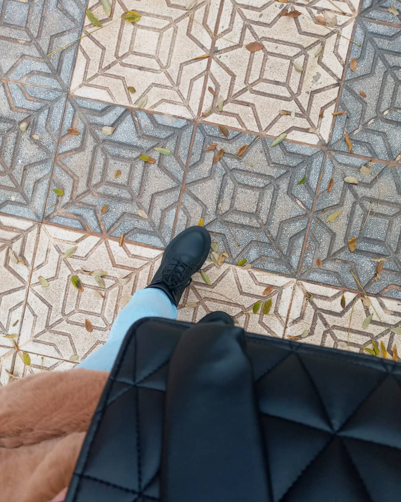

<!DOCTYPE html>
<html>
    <head>
        <meta charset="UTF-8">
        <title>
            Document sans nom 
        </title>
        <link rel="stylesheet" href="tp1.css">
        
    </head>
    <body>
        

    
    

    <h1> Beziane Maissoune</h1>
    étudiant <strong> informatique</strong>
    

        
        
        
        
        
    

  

  

    

    

    

        

        <!-------ici notre menu------->
        

<ul>
    <li><a href="">The information</a></li>
    <li style="float:right"><a href="" class="active">Contact</a></li>
    <li><a href="">Skills</a></li>
    <li><a href="">Diploma</a></li>
    <li><a href="">Serviers</a></li>
    <li><a href="">Language</a></li>
    
</ul>

        

    
<u><b><i>Beziane Maissoune</i></b></u>

        
    

        <li>Obtained a baccalaureate 2020</li>  
        <li>Second year student , computer sience </li>  
        <li> I study at the university of Mustapha Benboulaid batna2</li>  
         
    
    

    
<u><b><i>Skills </i></b></u>

        
    

        <li>Programming Languages : java , c++</li>  
        <li>Frontend : HTML , CSS, Js </li>  
        <li> Backend : Node.js</li>  
         
    
    

    
<u><b><i>Diploma </i></b></u>

        

        <li>informatique </li>  
        <li> Accounting</li>  
         
    
    

    
<u><b><i>Serviers</i></b></u>

    

    <li>website Desing </li>  
    <li>Mobile Application desing  </li>  
    <li>Animation</li>  
    
     

<u><b><i> Language </i></b></u>

        

        <li>arabic </li>  
        <li> French </li>  
         
    
    

    
<u><b><i> contact  </i></b></u>

        

        <li><b><i>cEmail id :</i></b> maissounebeziane@gmail.com</li>  
     <li><b><i>mobile no :</i></b> 066864.... </li>  
     <li><b><i>Instagram:</i></b> Maissoune_bz</li>  
     <li><b><i>Facebook:</i></b> Mai Ssoune </li>  
     <li><b><i>pinterst :</i></b> Maissoune</li>  
         
    
    

    
    

        
univ batna2

    

<!---formulaire newsletter--->

    <h2>abonnez-vous à liste de diffusion</h2>
    <form class="inscreption">
        <input type="email" placeholder="maissounebeziane@gmailcom" required autocomplete="off">
        <button type="submit">inscription</button>
    </form>

    <h2> RS  
        
        
        
        
        
    
    </h2>

    </body>
</html>
